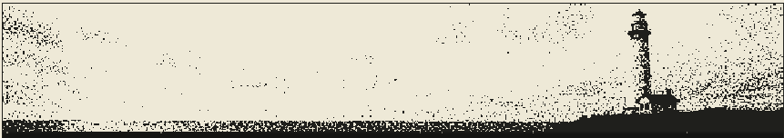

# The Lighthouse

[](https://ricardobertolin.github.io/the_lighthouse_app/)

[**Open the app →**](https://ricardobertolin.github.io/the_lighthouse_app/)

A personal daily news digest: fetches RSS + GNews, ranks against your
interests, has Claude write bilingual headlines and summaries, and publishes a
static page to GitHub Pages.

## Running it

The digest builds itself daily in GitHub Actions
(`.github/workflows/daily-digest.yml`, 13:00 UTC / 10:00 in Curitiba). It needs
two repository secrets:

| Secret | Used for |
| --- | --- |
| `ANTHROPIC_API_KEY` | headline/summary synthesis |
| `GNEWS_API_KEY` | discovery queries beyond the RSS feeds |

`lighthouse-daily.ps1` + `setup-scheduler.ps1` still run the same pipeline from
a local Windows box if you'd rather not use Actions.

### Commands

```
python -m digest                    # full pipeline, opens the browser
python -m digest --no-browser       # full pipeline, no browser
python -m digest --fetch-only       # stage 1 only: fetch + dedup, print results
python -m digest --render-only      # re-render today from the stored synthesis
python -m digest --weather rainy    # preview a weather scene to its own file
python -m digest --ingest-clicks F  # import reading history exported from the page
python -m digest --prune            # apply the retention policy + VACUUM
python -m unittest discover -s tests
```

## Teaching it what you like

Ranking starts from the topics in `config.yaml`, but the real signal is what
you actually open. The page is static, so clicks accumulate in `localStorage`
and you hand them over manually:

1. Open the digest, read as usual.
2. Scroll to the footer — **N read since last export** → **Export**.
3. `python -m digest --ingest-clicks ~/Downloads/lighthouse-clicks-2026-08-10.json`

From then on, relevance is blended toward the centroid of what you've read.
`click_weight` in `config.yaml` controls how hard (0 = ignore history,
1 = ignore the configured topics).

## How ranking works

Each article gets three signals, **each normalized across the day's batch** so
the configured weights actually mean what they say:

| Signal | Weight | How |
| --- | --- | --- |
| relevance | 0.50 | best match across topic vectors, z-scored per topic, blended with your click centroid |
| reputation | 0.30 | trusted-domain list from `config.yaml` |
| corroboration | 0.20 | distinct domains covering the same story, clustered by embedding similarity |

Two details that matter:

- **Topics are embedded separately and z-scored per topic.** A single vector
  averaged over "AI + geopolitics + climate + Curitiba" sits between all of
  them and is close to none. And raw per-topic similarity is not comparable
  across topics — on a corpus that's ~60% Brazilian news, the Portuguese
  topics average ~0.23 cosine against the English tech topics' ~0.01, purely
  because the multilingual model clusters by language. Z-scoring per topic
  makes the comparison language-neutral.
- **Corroboration clusters embeddings, not titles.** Exact title matching
  found a second source for 0.7% of articles; two outlets essentially never
  write byte-identical headlines.

## Storage

`digest.db` is the dedup memory. `is_seen()` only ever reads `url_hash`, so
article text is stripped after `retention.keep_full_days` (30) and rows are
dropped entirely after `retention.delete_after_days` (365). A stripped row
costs ~289 bytes vs ~1.8 KB with text; at steady state that's roughly 50 MB
instead of unbounded growth. Pruning runs at the end of every full pipeline.

In Actions the DB lives in the workflow cache. If that cache is ever evicted,
dedup memory resets and some already-seen articles resurface once — the digest
degrades, it doesn't break.
